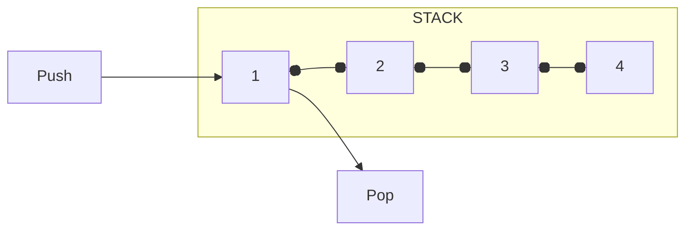

# David Beazley - A Talk Near the Future of Python (a.k.a., Dave live-codes a WebAssembly Interpreter)

<iframe width="560" height="315" src="https://www.youtube.com/embed/r-A78RgMhZU" title="YouTube video player" frameborder="0" allow="accelerometer; autoplay; clipboard-write; encrypted-media; gyroscope; picture-in-picture" allowfullscreen></iframe>

When you start working with machines, you start coming across a lot of different structures. One of the things you might come across is a [*stack*](https://en.wikipedia.org/wiki/Stack_(abstract_data_type)).




A stack is actually really easy to implement in python, you start with a list and then a stack has two operations on it - a _"push items"_ where we just append something onto the stack, and a _"pop items"_ where we just return something back from the stack.

```python
class Stack:
    def __init__(self):
        self.items = []

    def push(self, item):
        self.items.append(item)

    def pop(self):
        return self.items.pop()
```

Now, it turns out that stacks can be used for all sorts of amazing stuff, like making little machines. You can actually use this stack structure to make your own little machine code or executor.

An example of what something like that might look like, is you can come up with a little stack-based machine language, for example:

```python hl_lines="12-20"
class Stack:
    def __init__(self):
        self.items = []

    def push(self, item):
        self.items.append(item)

    def pop(self):
        return self.items.pop()


def example():
    # Compute 2 + 3 * 0.1
    code = [
        ("const", 2),
        ("const", 3),
        ("const", 0.1),
        ("mul",),
        ("add",),
    ]
```

This example computes `2 + 3 * 0.1`. Here's how we might go about doing something like that - we'll start by taking our stack and giving it an `execute` method.

```python hl_lines="11-13"
class Machine: # We've renamed our Stack class
    def __init__(self):
        self.items = []

    def push(self, item):
        self.items.append(item)

    def pop(self):
        return self.items.pop()

    def execute(self, instructions):
        for op, *args in instructions:
            ...


def example():
    # Compute 2 + 3 * 0.1
    code = [
        ("const", 2),
        ("const", 3),
        ("const", 0.1),
        ("mul",),
        ("add",),
    ]
```

Then we'll write a little loop where we just execute op-codes in this instruction sequence. We can say _"give me an operation and maybe some arguments to the instruction"_, and then we can write a little machine.

For instance, we can say if the op is `const`, then we push something onto the stack.

```python hl_lines="13 14"
class Machine:
    def __init__(self):
        self.items = []

    def push(self, item):
        self.items.append(item)

    def pop(self):
        return self.items.pop()

    def execute(self, instructions):
        for op, *args in instructions:
            if op == 'const':
                self.push(args[0])
```

If the op is `add`, then we can implement it as follows:

``` python hl_lines="15-18"
class Machine:
    def __init__(self):
        self.items = []

    def push(self, item):
        self.items.append(item)

    def pop(self):
        return self.items.pop()

    def execute(self, instructions):
        for op, *args in instructions:
            if op == 'const':
                self.push(args[0])
            elif op == 'add':
                right = self.pop() # (1)
                left = self.pop() # (2)
                self.push(left+right) # (3)
```

1.  Pull the `right` thing off of the stack.
2.  Pull the `left` thing off of the stack.
3.  Put the `result` back _onto_ the stack.


We can implement `multiply` in much the same way.

```python hl_lines="20-23"
class Machine:
    def __init__(self):
        self.items = []

    def push(self, item):
        self.items.append(item)

    def pop(self):
        return self.items.pop()

    def execute(self, instructions):
        for op, *args in instructions:
            print(op, args, self.items)
            if op == 'const':
                self.push(args[0])
            elif op == 'add':
                right = self.pop()
                left = self.pop()
                self.push(left+right)
            elif op == 'mul':
                right = self.pop()
                left = self.pop()
                self.push(left*right)
```

Let's also add a `print` statement to our execute method, and a safeguard in case we mess up later so we can see what's going on when we run this:

```python hl_lines="13 24 25"
class Machine:
    def __init__(self):
        self.items = []

    def push(self, item):
        self.items.append(item)

    def pop(self):
        return self.items.pop()

    def execute(self, instructions):
        for op, *args in instructions:
            print(op, args, self.items)
            if op == 'const':
                self.push(args[0])
            elif op == 'add':
                right = self.pop()
                left = self.pop()
                self.push(left+right)
            elif op == 'mul':
                right = self.pop()
                left = self.pop()
                self.push(left*right)
            else:
                raise RuntimeError(f'Bad op {op}')

def example():
    # Compute 2 + 3 * 0.1
    code = [
        ("const", 2),
        ("const", 3),
        ("const", 0.1),
        ("mul",),
        ("add",),
    ]
    m = Machine()
    m.execute(code)
    print("Result:", m.pop())


if __name__ == "__main__":
    example()
```

All of a sudden, we're on the way to making a little machine.

The way that this works is that we setup our little machine, then we execute code, and then if it works, the result will just be there on the top of the stack.

```pycon
>>> python machine.py
const [2] []
const [3] [2]
const [0.1] [2, 3]
mul [] [2, 3, 0.1]
add [] [2, 0.30000000000000004]
Result: 2.3
```

What we can see is that it's churning through operations, and what comes out is the result `2.3`.

So now we've got the start of a little machine. If we start playing around with this a little bit more, we start thinking _"maybe I could make this more like a CPU, I could give it more features"_. So maybe one of the features we want to give it is some memory by adding a bytearray of simulated memory:

```python hl_lines="2 4"
class Machine:
    def __init__(self, memsize=65536): # (1)
        self.items = []
        self.memory = bytearray(memsize)

    def push(self, item):
        self.items.append(item)

    def pop(self):
        return self.items.pop()

    def execute(self, instructions):
        for op, *args in instructions:
            print(op, args, self.items)
            if op == 'const':
                self.push(args[0])
            elif op == 'add':
                right = self.pop()
                left = self.pop()
                self.push(left+right)
            elif op == 'mul':
                right = self.pop()
                left = self.pop()
                self.push(left*right)
            else:
                raise RuntimeError(f'Bad op {op}')

def example():
    # Compute 2 + 3 * 0.1
    code = [
        ("const", 2),
        ("const", 3),
        ("const", 0.1),
        ("mul",),
        ("add",),
    ]
    m = Machine()
    m.execute(code)
    print("Result:", m.pop())


if __name__ == "__main__":
    example()
```

1. The most memory we could _possibly_ need is 64k. :wink:


Then maybe we start adding some functions to `store` and `load` from memory:

```python hl_lines="6 7 9 10"
class Machine:
    def __init__(self, memsize=65536):
        self.items = []
        self.memory = bytearray(memsize)

    def load(self, addr):
        ...

    def store(self, addr, val):
        ...

    def push(self, item):
        self.items.append(item)

    def pop(self):
        return self.items.pop()

    def execute(self, instructions):
        for op, *args in instructions:
            print(op, args, self.items)
            if op == 'const':
                self.push(args[0])
            elif op == 'add':
                right = self.pop()
                left = self.pop()
                self.push(left+right)
            elif op == 'mul':
                right = self.pop()
                left = self.pop()
                self.push(left*right)
            else:
                raise RuntimeError(f'Bad op {op}')

def example():
    # Compute 2 + 3 * 0.1
    code = [
        ("const", 2),
        ("const", 3),
        ("const", 0.1),
        ("mul",),
        ("add",),
    ]
    m = Machine()
    m.execute(code)
    print("Result:", m.pop())


if __name__ == "__main__":
    example()
```

The problem with loading and storing is that we'll have to make some decisions about how the memory actually _works_. We'll have to pull something out of the memory and make some decisions as to what's there.

So, for lack of a better alternative, let's just assume that _everything_ is a floating point number. We'll basically do some memory unpacking of a value.

```python hl_lines="1 9 12"
import struct # (1)

class Machine:
    def __init__(self, memsize=65536):
        self.items = []
        self.memory = bytearray(memsize)

    def load(self, addr):
        return struct.unpack('<d', self.memory[addr:addr+8])[0]

    def store(self, addr, val):
        self.memory[addr:addr+8] = struct.pack('<d', val)

# Code below ommitted 👇
```

1. !!! info
    If you haven't used the `struct` module before in python, it's a way of packing values. [https://docs.python.org/3/library/struct.html](https://docs.python.org/3/library/struct.html)


Now we can add some more instructions for `load` and `store`.

Loading will be popping a value off the stack and then pushing the value of loading it.

```python hl_lines="14-16"
    def execute(self, instructions):
        for op, *args in instructions:
            print(op, args, self.items)
            if op == 'const':
                self.push(args[0])
            elif op == 'add':
                right = self.pop()
                left = self.pop()
                self.push(left+right)
            elif op == 'mul':
                right = self.pop()
                left = self.pop()
                self.push(left*right)
            elif op == 'load':
                addr = self.pop()
                self.push(self.load(addr))
            elif op == 'store':
                var = self.pop()
                addr = self.pop()
                self.store(addr, var)
            else:
                raise RuntimeError(f'Bad op {op}')

# Code below ommitted 👇
```

If we want to do a store, we would get a value off the stack and then get an address off of the stack, and then put that into memory.

```python hl_lines="17-20"
    def execute(self, instructions):
        for op, *args in instructions:
            print(op, args, self.items)
            if op == 'const':
                self.push(args[0])
            elif op == 'add':
                right = self.pop()
                left = self.pop()
                self.push(left+right)
            elif op == 'mul':
                right = self.pop()
                left = self.pop()
                self.push(left*right)
            elif op == 'load':
                addr = self.pop()
                self.push(self.load(addr))
            elif op == 'store':
                var = self.pop()
                addr = self.pop()
                self.store(addr, var)
            else:
                raise RuntimeError(f'Bad op {op}')
```

Now that we've added these types of instructions, suddenly our programs start to be able to be more powerful, having the concept of **variables**. In order to make that work, we need to give our variables a memory address - effectively these are pointers.

```python
def example():
    # x = 2
    # v = 3
    # x = x + v * 0.1
    code = [
        ("const", 2),
        ("const", 3),
        ("const", 0.1),
        ("mul",),
        ("add",),
    ]
    m = Machine()
    m.execute(code)
    print("Result:", m.pop())
```

So we need to pick some number where `x` and `v` are going to "live".

If we want to load from variables, the basic steps are:

1. Put the address of a variable on the stack.
2. Load it.
3. Put the address of the _other_ variable on the stack.
4. Load _that_.
5. Store the resulting value.

```python hl_lines="5 6 9-13 17"
def example():
    # x = 2
    # v = 3
    # x = x + v * 0.1
    x_addr = 22
    v_addr = 42

    code = [
        ("const", x_addr),
        ("const", x_addr),
        ("load",),
        ("const", v_addr),
        ("load",),
        ("const", 0.1),
        ("mul",),
        ("add",),
        ("store",)
    ]
    m = Machine()
    m.execute(code)
    print("Result:", m.pop())
```

!!! info
    We've got this structured a little weirdly, we have to put the address _first_ and then the value to store _afterwards_.

The way the machine works, we need to make sure we're setting up our variables, and then at the end, instead of popping something out, we would just load it out of `x`:

```python hl_lines="63 64 66"
import struct

class Machine:
    def __init__(self, memsize=65536):
        self.items = []
        self.memory = bytearray(memsize)

    def load(self, addr):
        return struct.unpack('<d', self.memory[addr:addr+8])[0]

    def store(self, addr, val):
        self.memory[addr:addr+8] = struct.pack('<d', val)

    def push(self, item):
        self.items.append(item)

    def pop(self):
        return self.items.pop()

    def execute(self, instructions):
        for op, *args in instructions:
            print(op, args, self.items)
            if op == 'const':
                self.push(args[0])
            elif op == 'add':
                right = self.pop()
                left = self.pop()
                self.push(left+right)
            elif op == 'mul':
                right = self.pop()
                left = self.pop()
                self.push(left*right)
            elif op == 'load':
                addr = self.pop()
                self.push(self.load(addr))
            elif op == 'store':
                var = self.pop()
                addr = self.pop()
                self.store(addr, var)
            else:
                raise RuntimeError(f'Bad op {op}')


def example():
    # x = 2
    # v = 3
    # x = x + v * 0.1
    x_addr = 22
    v_addr = 42

    code = [
        ("const", x_addr),
        ("const", x_addr),
        ("load",),
        ("const", v_addr),
        ("load",),
        ("const", 0.1),
        ("mul",),
        ("add",),
        ("store",)
    ]
    m = Machine()
    m.store(x_addr, 2.0)
    m.store(v_addr, 3.0)
    m.execute(code)
    print("Result:", m.load(x_addr))

if __name__ == "__main__":
    example()
```
When we run this, we get the same result as before:

```pycon
>>> python machine.py
const [22] []
const [22] [22]
load [] [22, 22]
const [42] [22, 2.0]
load [] [22, 2.0, 42]
const [0.1] [22, 2.0, 3.0]
mul [] [22, 2.0, 3.0, 0.1]
add [] [22, 2.0, 0.30000000000000004]
store [] [22, 2.3]
Result: 2.3
```

Now, you might be looking at this code and saying _"Well that's great, we have math operations, we have load and store and stuff, but what we really need is some **functions**."_

Could we add that, some function `update_position` that computes that result?

```python hl_lines="2 3"
def example():
    # def update_position(x, v, dt):
    #     return x + v * dt
    # x = 2
    # v = 3
    # x = x + v * 0.1
    x_addr = 22
    v_addr = 42

    code = [
        ("const", x_addr),
        ("const", x_addr),
        ("load",),
        ("const", v_addr),
        ("load",),
        ("const", 0.1),
        ("mul",),
        ("add",),
        ("store",)
    ]
    m = Machine()
    m.store(x_addr, 2.0)
    m.store(v_addr, 3.0)
    m.execute(code)
    print("Result:", m.load(x_addr))

if __name__ == "__main__":
    example()
```

It turns out that that's not too difficult to implement as well. We introduce the concept of a function to our machine using a `Function` class.

There's a few concepts related to functions such as _"how many parameters does the function take, does it return a value, what code is associated with it?"_ which we'll add to our class too:

```python hl_lines="3-7"
import struct

class Function:
    def __init__(self, nparams, returns, code):
        self.nparams = nparams
        self.returns = returns
        self.code = code


class Machine:
    def __init__(self, memsize=65536):
        self.items = []
        self.memory = bytearray(memsize)

# Code below ommitted 👇
```

Then what we need to do is add a little bit of stuff to our machine to make **function calls** work.

One way we can implement that is by adding a `call` method where we pass in a function and some arguments, and then we setup a function call.

Another thing we need with functions is the concept of **local variables**. Normally when we call a function, we get new local variables and parameters.

So we need make a map between the numbers and the arguments, then send our locals and our function code to the execute function. Finally, if the function returns something, we'll pop something off of the stack.

```python hl_lines="26-30"
import struct

class Function:
    def __init__(self, nparams, returns, code):
        self.nparams = nparams
        self.returns = returns
        self.code = code

class Machine:
    def __init__(self, memsize=65536):
        self.items = []
        self.memory = bytearray(memsize)

    def load(self, addr):
        return struct.unpack('<d', self.memory[addr:addr+8])[0]

    def store(self, addr, val):
        self.memory[addr:addr+8] = struct.pack('<d', val)

    def push(self, item):
        self.items.append(item)

    def pop(self):
        return self.items.pop()

    def call(self, func, *args):
        locals = dict(enumerate(args)) # (1)
        self.execute(func.code, locals)
        if func.returns:
            return self.pop()

# Code below ommitted 👇
```

1. `{0: args[0], 1:args[1], 2: args[2]}`


We then modify our execute code to take in the locals and then build some more features around it such as operations for dealing with the local variables. For instance, we can create an operator for `local.get` that puts something onto the stack by looking it up in the locals dictionary.

```python hl_lines="1 21 22"
    def execute(self, instructions, locals):
        for op, *args in instructions:
            print(op, args, self.items)
            if op == 'const':
                self.push(args[0])
            elif op == 'add':
                right = self.pop()
                left = self.pop()
                self.push(left+right)
            elif op == 'mul':
                right = self.pop()
                left = self.pop()
                self.push(left*right)
            elif op == 'load':
                addr = self.pop()
                self.push(self.load(addr))
            elif op == 'store':
                var = self.pop()
                addr = self.pop()
                self.store(addr, var)
            elif op == 'local.get':
                self.push(locals[args[0]])
            else:
                raise RuntimeError(f'Bad op {op}')
```

We can then add another operation `local.set` that does the opposite.

```python hl_lines="23 24"
    def execute(self, instructions, locals):
        for op, *args in instructions:
            print(op, args, self.items)
            if op == 'const':
                self.push(args[0])
            elif op == 'add':
                right = self.pop()
                left = self.pop()
                self.push(left+right)
            elif op == 'mul':
                right = self.pop()
                left = self.pop()
                self.push(left*right)
            elif op == 'load':
                addr = self.pop()
                self.push(self.load(addr))
            elif op == 'store':
                var = self.pop()
                addr = self.pop()
                self.store(addr, var)
            elif op == 'local.get':
                self.push(locals[args[0]])
            elif op == 'local.set':
                locals[args[0]] = self.pop()
            else:
                raise RuntimeError(f'Bad op {op}')
```

This is similar to `load` and `store`, except that it's manipulating the locals piece a little bit.

The other thing we need for functions is we need some way to _call_ a function. This is a little bit tricky, because inside of our call we need some way to reference the function.

In order to do that, we're going to extend our machine with a **function table**.

```python hl_lines="10 11"
import struct

class Function:
    def __init__(self, nparams, returns, code):
        self.nparams = nparams
        self.returns = returns
        self.code = code

class Machine:
    def __init__(self, functions, memsize=65536):
        self.functions = functions # function table
        self.items = []
        self.memory = bytearray(memsize)

    def load(self, addr):
        return struct.unpack('<d', self.memory[addr:addr+8])[0]

    def store(self, addr, val):
        self.memory[addr:addr+8] = struct.pack('<d', val)

# Code below ommitted 👇
```

And then inside our `call` operator, we'll look up the function. We also need the arguments for our function, so we'll pop those off the stack. One tricky thing about popping the arguments off the stack is that they're going to be in reverse order.

Then we have all the information needed to call our function. If our function returns something, then we'll take the result and put it back on the stack.

```python hl_lines="25-31"
    def execute(self, instructions, locals):
        for op, *args in instructions:
            print(op, args, self.items)
            if op == 'const':
                self.push(args[0])
            elif op == 'add':
                right = self.pop()
                left = self.pop()
                self.push(left+right)
            elif op == 'mul':
                right = self.pop()
                left = self.pop()
                self.push(left*right)
            elif op == 'load':
                addr = self.pop()
                self.push(self.load(addr))
            elif op == 'store':
                var = self.pop()
                addr = self.pop()
                self.store(addr, var)
            elif op == 'local.get':
                self.push(locals[args[0]])
            elif op == 'local.set':
                locals[args[0]] = self.pop()
            elif op == 'call':
                func = self.functions[args[0]]
                # The underscore just means we're disregarding the variable.
                fargs = reversed([ self.pop() for _ in range(func.nparams) ])
                result = self.call(func, *fargs)
                if func.returns:
                    self.push(result)
            else:
                raise RuntimeError(f'Bad op {op}')
```

!!! note
    `returns` we're treating as a boolean, as in _does this function return something or not?_

What this means in our machine code is that you would have to define functions in the machine code:

```python hl_lines="69-80 92 95"
import struct

class Function:
    def __init__(self, nparams, returns, code):
        self.nparams = nparams
        self.returns = returns
        self.code = code

class Machine:
    def __init__(self, functions, memsize=65536):
        self.functions = functions  # function table
        self.items = []
        self.memory = bytearray(memsize)

    def load(self, addr):
        return struct.unpack("<d", self.memory[addr : addr + 8])[0]

    def store(self, addr, val):
        self.memory[addr : addr + 8] = struct.pack("<d", val)

    def push(self, item):
        self.items.append(item)

    def pop(self):
        return self.items.pop()

    def call(self, func, *args):
        locals = dict(enumerate(args))  # {0: args[0], 1:args[1], 2: args[2]}
        self.execute(func.code, locals)
        if func.returns:
            return self.pop()

    def execute(self, instructions, locals):
        for op, *args in instructions:
            print(op, args, self.items)
            if op == "const":
                self.push(args[0])
            elif op == "add":
                right = self.pop()
                left = self.pop()
                self.push(left + right)
            elif op == "mul":
                right = self.pop()
                left = self.pop()
                self.push(left * right)
            elif op == "load":
                addr = self.pop()
                self.push(self.load(addr))
            elif op == "store":
                var = self.pop()
                addr = self.pop()
                self.store(addr, var)
            elif op == "local.get":
                self.push(locals[args[0]])
            elif op == "local.set":
                locals[args[0]] = self.pop()
            elif op == "call":
                func = self.functions[args[0]]
                # The underscore just means we're disregarding the variable.
                fargs = reversed([self.pop() for _ in range(func.nparams)])
                result = self.call(func, *fargs)
                if func.returns:
                    self.push(result)
            else:
                raise RuntimeError(f"Bad op {op}")


def example():
    update_position = Function(
        nparams=3,
        returns=True,
        code=[
            ("local.get", 0),  # getting x
            ("local.get", 1),  # getting v
            ("local.get", 2),  # getting dt
            ("mul",),
            ("add",),
        ],
    )
    functions = [update_position]

    x_addr = 22
    v_addr = 42

    code = [
        ("const", x_addr),
        ("const", x_addr),
        ("load",),
        ("const", v_addr),
        ("load",),
        ("const", 0.1),
        ("call", 0),  # Function 0: update_position
        ("store",),
    ]
    m = Machine(functions)
    m.store(x_addr, 2.0)
    m.store(v_addr, 3.0)
    m.execute(code, None)
    print("Result:", m.load(x_addr))

if __name__ == "__main__":
    example()
```

When we execute it we get the exact same answer as before:

```bash
>>> python machine.py
const [22] []
const [22] [22]
load [] [22, 22]
const [42] [22, 2.0]
load [] [22, 2.0, 42]
const [0.1] [22, 2.0, 3.0]
mul [] [22, 2.0, 3.0, 0.1]
add [] [22, 2.0, 0.30000000000000004]
store [] [22, 2.3]
Result: 2.3
```

!!! info
    This is actually how python itself works, it's actually a little stack machine. What's happening under the hood is python takes python code turns it into python machine code! You can see the same types of instructions as what we've been implementing - load x, load v, load dt, etc.

    ```pycon
    >>> def update_position(x, v, dt):
    ...    return x + v * dt
    ...
    >>> import dis
    >>> dis.dis(update_position)
    2           0 LOAD_FAST                0 (x)
                2 LOAD_FAST                1 (v)
                4 LOAD_FAST                2 (dt)
                6 BINARY_MULTIPLY
                8 BINARY_ADD
                10 RETURN_VALUE
    ```

One thing our machine is missing is a critical feature - there's no way to do control flow like with an `if` statement.

We also don't have any way to do loops, like `while` loops for example. Right now, our machine is just going through instructions and that's it. In order to implement these features, we need to introduce some type of branching instruction.

In order to do a branch, we'll need some `goto`-like statement, some kind of jump. `goto` statements tend to offend people, and we don't even _have_ a `goto` statement in python. So what's the next best thing? Raising an exception! If we want our program to stop or branch, one way to do that is just to stop.

```python hl_lines="8-12 16-18"
    elif op == "call":
        func = self.functions[args[0]]
        # The underscore just means we're disregarding the variable.
        fargs = reversed([self.pop() for _ in range(func.nparams)])
        result = self.call(func, *fargs)
        if func.returns:
            self.push(result)
    elif op == 'br':
        raise Break(args[0])
    elif op == 'br_if': # If the top thing on the stack is True, Break
        if self.pop():
            raise Break(args[0])
    else:
        raise RuntimeError(f"Bad op {op}")

class Break(Exception):
    def __init__(self, level):
        self.level = level
```

!!! note
    Not only are we breaking, but there's a level that we can dial up.

The other thing we'll introduce at this point is the idea of a **code block**, which is basically a nested set of instructions.

What we're going to do with the code block is essentially just try to execute it. We'll catch the `Break` exception, and if the level is still high, we'll decrement the level by one and re-raise the exception.

```python hl_lines="6-12"
    elif op == 'br':
        raise Break(args[0])
    elif op == 'br_if': # If the top thing on the stack is True, Break
        if self.pop():
            raise Break(args[0])
    elif op == 'block':
        try:
            self.execute(args[0], locals)
        except Break as b:
            if b.level > 0:
                b.level -= 1
                raise
    else:
        raise RuntimeError(f"Bad op {op}")
```

This _looks_ really strange. But what we get out of this is using nothing but `block` and `Break`, we can implement an `if` statement.

Here's what an `if` statement looks like in our machine code:

```python
('block', [
    ('block', [
        test
        ('br_if', 0), # Goto 0
        alternative,
        ('br', 1), # Goto 1
    ]), # Label : 0
    consequence,
]) # Label : 1
```

!!! info
    Basically, the end of the inner block is labelled `0`, and the end of the outer block is label `1`. And then our `br_if` and `br` instructions end up basically like `goto` statements.

    We do the test, and if the test is `True`, then we bail on the rest of the block and skip to label `0` and run the consequence. If the test is `False`, then we run the alternative.

We can apply the same pattern to loops. To implement a `while` loop, we'll introduce a `loop` instruction. We're going to go into an infinite loop where we just try to execute a bunch of code and right after execution we break and do the same thing as before to catch the exception and decrement the level.

```python hl_lines="8-16"
    elif op == 'block':
        try:
            self.execute(args[0], locals)
        except Break as b:
            if b.level > 0:
                b.level -= 1
                raise
    elif op == 'loop':
        while True:
            try:
                self.execute(args[0], locals)
                break
            except Break as b:
                if b.level > 0:
                    b.level -= 1
                    raise
    else:
        raise RuntimeError(f"Bad op {op}")
```

This is how we would introduce a `while` loop in our machine code. It turns out that these blocks basically have "magic labels" that we can go to.

```python
('block', [
    ('loop', [ # Label 0
        not test
        ('br_if', 1), # Goto 1: (break)
        body,
        ('br', 0), # Goto 0: (continue)
    ])
]) # Label 1
```

The other thing we'll introduce is the funtion `Return`, which basically tries to break out of everything, which we'll catch up in our `call`:

```python hl_lines="27-34 44 45 47 48"
import struct

class Function:
    def __init__(self, nparams, returns, code):
        self.nparams = nparams
        self.returns = returns
        self.code = code

class Machine:
    def __init__(self, functions, memsize=65536):
        self.functions = functions  # function table
        self.items = []
        self.memory = bytearray(memsize)

    def load(self, addr):
        return struct.unpack("<d", self.memory[addr : addr + 8])[0]

    def store(self, addr, val):
        self.memory[addr : addr + 8] = struct.pack("<d", val)

    def push(self, item):
        self.items.append(item)

    def pop(self):
        return self.items.pop()

    def call(self, func, *args):
        locals = dict(enumerate(args))  # {0: args[0], 1:args[1], 2: args[2]}
        try:
            self.execute(func.code, locals)
        except Return:
            pass
        if func.returns:
            return self.pop()

def execute(self, instructions, locals):
        for op, *args in instructions:
            print(op, args, self.items)
            if op == "const":
                self.push(args[0])

            ...

            elif op == 'return':
                raise Return()

class Return(Exception):
    pass
```

It turns out that having this allows us to write much more complicated programs.

=== "Our machine program"

    ```python
    m.execute([
        ('block', [
            ('loop', [
                ('const', x_addr),
                ('load',),
                ('const', 0.0),
                ('le',),
                ('br_if', 1),
                ('const', x_addr),
                ('const', x_addr),
                ('load',),
                ('const', v_addr),
                ('load',),
                ('const', 0.1),
                ('call', 0),
                ('store',),
                ('block', [
                    ('const', x_addr),
                    ('load',),
                    ('const', 70.0),
                    ('ge',),
                    ('block', [
                        ('br_if', 0),
                        ('br', 1),
                    ]),
                    ('const', v_addr),
                    ('const', 0.0),
                    ('const', v_addr),
                    ('load',),
                    ('sub',),
                    ('store',)
                ]),
                ('br', 0),
            ])
        ])
    ], None) # This None is the locals
    ```

=== "The same program in python"

    ```python
    while x > 0:
        x = update_position(x, v, 0.1)
        if x >= 70:
            v = -v
    ```

!!! info
    What this is doing is it's creating a `while` loop where it's updating the position, and then checking if the position got too far, and if so, it flips the direction.

In order for this example to work, we need to add a few more operations to the machine.

It turns out we can't do `if` statements without conditionals or relations - we need things like `less than`, `greater than`, etc.

```python
    elif op == 'sub':
        right = self.pop()
        left = self.pop()
        self.push(left-right)
    elif op == 'le':
        right = self.pop()
        left = self.pop()
        self.push(left<=right)
    elif op == 'ge':
        right = self.pop()
        left = self.pop()
        self.push(left>=right)
```

Now we've reached a point where we have most of the makings of our machine.

But, it's hard to see any output from this machine - we don't have any display or something similar. It might be useful to have a python function that basically displays a player or something, that draws to the screen.


```python
def example():
    def py_display_player(x):
        import time
        print(' '*int(x) + '<0:>')
        time.sleep(0.02)
```

We want some way to execute our `py_display_player` function, so what about adding the ability to **import a function**? This allows us to bring in an external function that's not written in our machine, and _extend_ our function table.

```python
def example():
    def py_display_player(x):
        import time
        print(' '*int(x) + '<0:>')
        time.sleep(0.02)

    display_player = ImportFunction(nparams=1, returns=None, call=py_display_player)

    ...

    functions = [update_position, display_player]
```

Then we can add an extra instruction to do the import.

```python
# while x > 0:
#     x = update_position(x, v, 0.1)
#     if x >= 70:
#         v = -v

m.execute([
    ('block', [
        ('loop', [
            ('const', x_addr), # load x
            ('load',), # load x
            ('call', 1), # cal the function to display
            ('const', x_addr),
            ('load',),
            ('const', 0.0),
            ('le',),
            ('br_if', 1),
            ('const', x_addr),
            ('const', x_addr),
            ('load',),
            ('const', v_addr),
            ('load',),
            ('const', 0.1),
            ('call', 0),
            ('store',),
            ('block', [
                ('const', x_addr),
                ('load',),
                ('const', 70.0),
                ('ge',),
                ('block', [
                    ('br_if', 0),
                    ('br', 1),
                ]),
                ('const', v_addr),
                ('const', 0.0),
                ('const', v_addr),
                ('load',),
                ('sub',),
                ('store',)
            ]),
            ('br', 0),
        ])
    ])
], None) # This None is the locals

```

Adding this is not too difficult to do, we just base it off of our `Function` class, and then make the machine look for it.

```python hl_lines="9-13 33-46"
import struct

class Function:
    def __init__(self, nparams, returns, code):
        self.nparams = nparams
        self.returns = returns
        self.code = code

class ImportFunction:
    def __init__(self, nparams, returns, call):
        self.nparams = nparams
        self.returns = returns
        self.call = call

class Machine:
    def __init__(self, functions, memsize=65536):
        self.functions = functions  # function table
        self.items = []
        self.memory = bytearray(memsize)

    def load(self, addr):
        return struct.unpack("<d", self.memory[addr : addr + 8])[0]

    def store(self, addr, val):
        self.memory[addr : addr + 8] = struct.pack("<d", val)

    def push(self, item):
        self.items.append(item)

    def pop(self):
        return self.items.pop()

    def call(self, func, *args):
        locals = dict(enumerate(args))  # {0: args[0], 1:args[1], 2: args[2]}
        # if the function is a normal Function, do what we had before
        if isinstance(func, Function):
            try:
                self.execute(func.code, locals)
            except Return:
                pass
            if func.returns:
                return self.pop()
        # if it's not a normal function and is instead in ImportFunction
        else:
            # return the value of calling the external thing
            return func.call(*args)
```

But what we really want is not some text displaying on screen, we want something more visual, more interactive, something like [rocket game](https://aochagavia.github.io/rocket_wasm/) where you can move and shoot, etc.

[Rocket game](https://github.com/aochagavia/rocket_wasm) is using [WebAssembly](https://webassembly.org/) running in the browser, and it's written in [Rust](https://www.rust-lang.org/). What is Python's story for something like this?

What we're going to try to do, is run the Rust program inside of the interpreter that we just wrote. Because what we just wrote - is a WebAssembly interpreter.

`program.wasm` is compiled from Rust as a binary file. The game is an HTML document with some Javascript and it's a mix of Javascript and WebAssembly.

The machine we wrote can execute WebAssembly, but in order to do that, we need to make some changes.

One of those changes is that WebAssembly is a tiny CPU which only understands 4 data types - ints and floats, 32 and 64-bits.

```python
from numpy import (int32, int64, float32, float64)
```

!!! info
    We've imported these types from `numpy`, mainly so that we can claim this is a machine learning project. :wink:

We'll add an assertion on the stack push operation to make sure that we're only using those datatypes.

```python
    def push(self, item):
        assert type(item) in {int32, int64, float32, float64}
        self.items.append(item)
```

WebAssembly has a richer set of instructions which we'll need to add as well. It has instructions for creating constants:

```python

_const = {
    'i32.const': int32,
    'i64.const': int64,
    'f32.const': float32
    'f64.const': float64,
}
```

It has instructions for binary operations, things like `add`, `subtract`, `multiply`, `divide`, etc. We define these as basically a big table of `lambda` functions - there's nothing particulary special about what we're doing here, we're just trying to do this compactly.

```python
_binary = {
    # 32-bit integer
    'i32.add'   : lambda x, y: int32(x + y),
    'i32.sub'   : lambda x, y: int32(x - y),
    'i32.mul'   : lambda x, y: int32(x * y),
    'i32.div_s' : lambda x, y: int32(x // y),
    'i32.div_u' : lambda x, y: int32(uint32(x) / uint32(y)),
    'i32.and'   : lambda x, y: int32(x & y),
    'i32.or'    : lambda x, y: int32(x | y),
    'i32.xor'   : lambda x, y: int32(x ^ y),
    'i32.rem_s' : lambda x, y: int32(x % y),
    'i32.rem_u' : lambda x, y: int32(uint32(x) // uint32(y)),
    'i32.eq'    : lambda x, y: int32(x == y),
    'i32.ne'    : lambda x, y: int32(x != y),
    'i32.lt_s'  : lambda x, y: int32(x < y),
    'i32.le_s'  : lambda x, y: int32(x <= y),
    'i32.gt_s'  : lambda x, y: int32(x > y),
    'i32.ge_s'  : lambda x, y: int32(x >= y),
    'i32.lt_u'  : lambda x, y: int32(uint32(x) < uint32(y)),
    'i32.gt_u'  : lambda x, y: int32(uint32(x) > uint32(y)),
    'i32.le_u'  : lambda x, y: int32(uint32(x) <= uint32(y)),
    'i32.ge_u'  : lambda x, y: int32(uint32(x) >= uint32(y)),
    'i32.rotr'  : lambda x, y: int32((x >> y) | ((x & ((2**y)-1)) << (32-y))),
    'i32.rotl'  : lambda x, y: int32((x << y) | ((x & ((2**y)-1)) >> (32-y))),
    'i32.shr_u' : lambda x, y: int32(int(uint32(x)) >> int(y)),
    'i32.shl'   : lambda x, y: int32(x << y),

    # 64-bit integer
    'i64.add'   : lambda x, y: int64(x + y),
    'i64.sub'   : lambda x, y: int64(x - y),
    'i64.mul'   : lambda x, y: int64(x * y),
    'i64.div_s' : lambda x, y: int64(x // y),
    'i64.div_u' : lambda x, y: int64(uint64(x) / uint64(y)),
    'i64.and'   : lambda x, y: int64(x & y),
    'i64.or'    : lambda x, y: int64(x | y),
    'i64.xor'   : lambda x, y: int64(x ^ y),
    'i64.rem_s' : lambda x, y: int64(x % y),
    'i64.rem_u' : lambda x, y: int64(uint64(x) // uint64(y)),
    'i64.eq'    : lambda x, y: int32(x == y),
    'i64.ne'    : lambda x, y: int32(x != y),
    'i64.lt_s'  : lambda x, y: int32(x < y),
    'i64.le_s'  : lambda x, y: int32(x <= y),
    'i64.gt_s'  : lambda x, y: int32(x > y),
    'i64.ge_s'  : lambda x, y: int32(x >= y),
    'i64.lt_u'  : lambda x, y: int32(uint64(x) < uint64(y)),
    'i64.gt_u'  : lambda x, y: int32(uint64(x) > uint64(y)),
    'i64.le_u'  : lambda x, y: int32(uint64(x) <= uint64(y)),
    'i64.ge_u'  : lambda x, y: int32(uint64(x) >= uint64(y)),
    'i64.rotr'  : lambda x, y: int64((x >> y) | ((x & ((2**y)-1)) << (64-y))),
    'i64.rotl'  : lambda x, y: int64((x << y) | ((x & ((2**y)-1)) >> (64-y))),
    'i64.shr_u' : lambda x, y: int64(int(uint64(x)) >> int(y)),
    'i64.shl'   : lambda x, y: int64(x << y),

    # -- 64 bit float
    'f64.add'   : lambda x, y: float64(x + y),
    'f64.sub'   : lambda x, y: float64(x - y),
    'f64.mul'   : lambda x, y: float64(x * y),
    'f64.div'   : lambda x, y: float64(x / y),
    'f64.eq'    : lambda x, y: int32(x == y),
    'f64.ne'    : lambda x, y: int32(x != y),
    'f64.lt'    : lambda x, y: int32(x < y),
    'f64.gt'    : lambda x, y: int32(x > y),
    'f64.le'    : lambda x, y: int32(x <= y),
    'f64.ge'    : lambda x, y: int32(x >= y),
}
```

There's also some unary operations, things like square root calculations, comparisons and so forth.

```python
import math
_unary = {
    'i32.eqz' : lambda x: int32(x == 0),
    'i32.clz' : lambda x: int32(32 - len(bin(uint32(x))[2:])),
    'i32.ctz' : lambda x: int32(len(bin(uint32(x)).rsplit('1',1)[-1])),
    'i32.wrap_i64' : lambda x: int32(uint64(x)),
    'i64.extend_i32_u' : lambda x: int64(uint32(x)),
    'f64.reinterpret_i64': lambda x: frombuffer(x.tobytes(), float64)[0],
    'f64.sqrt': lambda x: float64(math.sqrt(x)),
    'f64.convert_i32_u': lambda x: float64(uint32(x)),
}
```

There's also some operations for loading from memory. WebAssembly has these 4 data types, and it has different options for loading memory in different configurations.

```python
from numpy import (
     int8, uint8, int16, uint16, uint32, uint64, frombuffer,
     )

_load = {
    'i32.load'     : lambda raw: frombuffer(raw, int32)[0],
    'i64.load'     : lambda raw: frombuffer(raw, int64)[0],
    'f64.load'     : lambda raw: frombuffer(raw, float64)[0],
    'i32.load8_s'  : lambda raw: int32(frombuffer(raw, int8)[0]),
    'i32.load8_u'  : lambda raw: int32(frombuffer(raw, uint8)[0]),
    'i32.load16_s' : lambda raw: int32(frombuffer(raw, int16)[0]),
    'i32.load16_u' : lambda raw: int32(frombuffer(raw, uint16)[0]),
    'i64.load8_s'  : lambda raw: int64(frombuffer(raw, int8)[0]),
    'i64.load8_u'  : lambda raw: int64(frombuffer(raw, uint8)[0]),
    'i64.load16_s' : lambda raw: int64(frombuffer(raw, int16)[0]),
    'i64.load16_u' : lambda raw: int64(frombuffer(raw, uint16)[0]),
    'i64.load32_s' : lambda raw: int64(frombuffer(raw, int32)[0]),
    'i64.load32_u' : lambda raw: int64(frombuffer(raw, uint32)[0]),
}

_store = {
    'i32.store'   : lambda val: val.tobytes(),
    'i64.store'   : lambda val: val.tobytes(),
    'f64.store'   : lambda val: val.tobytes(),
    'i32.store8'  : lambda val: val.tobytes()[:1],
    'i32.store16' : lambda val: val.tobytes()[:2],
    'i64.store8'  : lambda val: val.tobytes()[:1],
    'i64.store16' : lambda val: val.tobytes()[:2],
    'i64.store32' : lambda val: val.tobytes()[:4],
}
```

Mostly what we're doing here is just inserting tables of short little functions. The code we've written can be modified to work with that - instead of using our minimal set of instructions, we're going to check for some table lookups.

WebAssembly also has a few more memory operators we have to implement.

```python
def execute(self, instructions, locals):
    for op, *args in instructions:
        print(op, args, self.items)
        if op in _const:
            self.push(_const[op](args[0])) # (1)
        elif op in _binary:
            right = self.pop()
            left = self.pop()
            self.push(_binary[op](left, right))
        elif op in _unary:
            self.push(_unary[op](self.pop()))
        elif op in _load:
            addr = self.pop() + args[1] # (2)
            self.push(_load[op](self.memory[addr:addr+8])) # (3)
        elif op in _store:
            val = self.pop()
            addr = self.pop() + args[1]
            raw = _store[op](val)
            self.memory[addr:addr+len(raw)] = raw
        elif op == 'memory.size':
            self.push(int32(len(self.memory)//65536))
        elif op == 'memory.grow':
            npages = self.pop()
            self.memory.extend(bytes(npages*65536)) # (4)
            self.push(int32(len(self.memory)//65536))
        elif op == 'local.get':
            self.push(locals[args[0]])
        elif op == 'local.set':
            locals[args[0]] = self.pop()
        elif op == 'local.tee': # (5)
            locals[args[0]] = self.items[-1]
        elif op == 'drop': # (6)
            self.pop()
        elif op == 'select': # (7)
            c = self.pop()
            v2 = self.pop()
            v1 = self.pop()
            self.push(v1 if c else v2)

        ...

        elif op == 'block':
            try:
                self.execute(args[1], locals) # (8)
            except Break as b:
                if b.level > 0:
                    b.level -= 1
                    raise
        elif op == 'br_table': # (9)
            n = self.pop()
            if n < len(args[0]):
                raise Break(args[0][n])
            else:
                raise Break(args[1])
```

1. Lookup in the const table
2. WebAssembly introduces an offset
3. This is a hack because nothing is larger than 64 bits.
4. WebAssembly treats memory essentially as a big byte array that you grow and shrink.
5. New operation where we pull an item off the stack without consuming it.
6. Just pop something off of the stack and forget about it.
7. Basically a ternary operation or a conditional
8. WebAssembly introduces a block type which we're going to ignore, but it changes the offset we're using on this line.
9. You pass a table of indexes along with a default, used to implement switch statements


Now the claim is that this code can run the rocket game, it can run the WebAssembly program written in Rust.

In order to do that, we still have this problem that WebAssembly is binary. How do we turn that into the Rocket game? It turns out that this format is very easy to decode. WebAssembly kinda rethought the whole concept of a DLL. wadze allows you to parse a WebAssembly module.

There's a lot of useful stuff inside the WebAssembly module. For starters, there's a whole bunch of information about the type signatures of all functions in the modules. One of the big problem with C libraries is that they do not encode type signatures. If you make a DLL, the type information is not in the DLL, it's in the C header file. So you have to parse through the C header files. In contrast, with WebAssembly, all the type signatures are included in the module. Another interesting thing about WebAssembly is that it will tell you what needs to be imported. These are basically functions that are defined outside of WebAssembly and have to be provided by Python or Javascript. It also has information about what is exported, what functions are defined that are exported from the module.

This is basically going to be the basis for our WebAssembly piece. For instance, the imported functions are things that _have_ to be implemented in python or Javascript, it's the functions that the module doesn't know about.

```python
import wadze
module = wadze.parse_module(open('program.wasm', 'rb').read())

import math

# These functions are imported by Wasm.
# Must be implemented in the host environment (Python).
# These are listed in the required order.
def imp_Math_atan(x):
    return float64(math.atan(x))

def imp_clear_screen():
    print('clear_screen')

def imp_cos(x):
    return float64(math.cos(x))

def imp_draw_bullet(x, y):
    print('draw_bullet', x, y)

def imp_draw_enemy(x, y):
    print('draw_enemy', x, y)

def imp_draw_particle(x, y, z):
    print('draw_particle', x, y, z)

def imp_draw_player(x, y, z):
    print('draw_player', x, y, z)

def imp_draw_score(s):
    print('draw_score', s)

def imp_sin(x):
    return float64(math.sin(x))

import machine

# (1)
imported_functions = [
    machine.ImportFunction(1, 1, imp_Math_atan),
    machine.ImportFunction(0, 0, imp_clear_screen),
    machine.ImportFunction(1, 1, imp_cos),
    machine.ImportFunction(2, 0, imp_draw_bullet),
    machine.ImportFunction(2, 0, imp_draw_enemy),
    machine.ImportFunction(3, 0, imp_draw_particle),
    machine.ImportFunction(3, 0, imp_draw_player),
    machine.ImportFunction(1, 0, imp_draw_score),
    machine.ImportFunction(1, 1, imp_sin),
]

# (2)
defined_functions = [ ]

for typeidx, code in zip(module['func'], module['code']): # (3)
    functype = module['type'][typeidx]
    func = machine.Function(nparams = len(functype.params),
                            returns = bool(functype.returns),
                            code = wadze.parse_code(code).instructions)
    defined_functions.append(func)

functions = imported_functions + defined_functions # (4)

# (5)
exports = { exp.name: functions[exp.ref] for exp in module['export']
            if isinstance(exp, wadze.ExportFunction) }

m = machine.Machine(functions, 20*65536) # (6)

# (7)
for data in module['data']:
    m.execute(data.offset, None)
    offset = m.pop()
    m.memory[offset:offset+len(data.values)] = data.values

from machine import float64, int32

width = float64(800.0)
height = float64(600.0)

m.call(exports['resize'], width, height) # (8)
```

1. Declare as imported functions for our "machine"
2. Declare "defined" functions, functions that are in WebAssembly
3. Take the two pieces from the module
4. Complete function table of python functions and Rust code functions
5. Declare "exported" functions
6. Hack on memory, the file does indicate how much memory the program needs but we're not going to bother
7. Initialize memory
8.  Call the resize function in Rust :pray:


Our program is doing something at this point, it's not crashing.

From here, let's just add a **game loop**.

```python
# Game loop
import time

last = time.time()
while True:
    now = time.time()
    dt = now - last
    last = now
    m.call(exports['update'], float64(dt)) # Call the update on the time delta
    m.call(exports['draw']) # update and draw are both WebAssembly functions written in Rust.
```

Our program is looping, but we want to be able to see what this is doing a little bit better.

```python
    def execute(self, instructions, locals):
        for op, *args in instructions:
            # Turn off the print statement
            # print(op, args, self.items)
```

We can now see what functions are being called. But we'd like to do something a bit more interesting with those functions.

Instead of just printing, maybe a more interesting thing to do would be to pump this over to pygame. With pygame, we'll need to add a bit of event handling to our game loop too.

```python
import pygame

pygame.init()

size = width, height = (800, 600)
screen = pygame.display.set_mode(size)
# font = pygame.font.SysFont("helvetica", 36)

def imp_clear_screen():
    screen.fill((0,0,0))

def imp_draw_bullet(x, y):
    pygame.draw.circle(screen, (255, 255, 255), (int(x), int(y)), 2)

def imp_draw_enemy(x, y):
    pygame.draw.circle(screen, (255,0,255), (int(x), int(y)), 15, 2)

def imp_draw_particle(x, y, z):
    pygame.draw.circle(screen, (255,255,0), (int(x),int(y)), abs(int(z)))

def imp_draw_player(x, y, z):
    pygame.draw.circle(screen, (0,255,255), (int(x), int(y)), 10, 2)

def imp_draw_score(s):
    print('draw_score', s)
#    text = font.render(f'Score: {int(s)}', True, (200,200, 0))
#    screen.blit(text, (5, 5))

# Game loop
import time

last = time.time()
while True:
    for event in pygame.event.get():
        pass

    now = time.time()
    dt = now - last
    last = now
    m.call(exports['update'], float64(dt)) # Call the update on the time delta
    m.call(exports['draw']) # update and draw are both WebAssembly functions written in Rust.
    pygame.display.flip() # The way to get pygame to render
```

Now we want to play the game, but we didn't put any keybindings in!

That's not hard to add - we just check for different keys, and then based on those keys, we call more Rust functions to do things like toggle shooting, turn left, etc.

```python
import pygame

pygame.init()

size = width, height = (800, 600)
screen = pygame.display.set_mode(size)
# font = pygame.font.SysFont("helvetica", 36)

def imp_clear_screen():
    screen.fill((0,0,0))

def imp_draw_bullet(x, y):
    pygame.draw.circle(screen, (255, 255, 255), (int(x), int(y)), 2)

def imp_draw_enemy(x, y):
    pygame.draw.circle(screen, (255,0,255), (int(x), int(y)), 15, 2)

def imp_draw_particle(x, y, z):
    pygame.draw.circle(screen, (255,255,0), (int(x),int(y)), abs(int(z)))

def imp_draw_player(x, y, z):
    pygame.draw.circle(screen, (0,255,255), (int(x), int(y)), 10, 2)

def imp_draw_score(s):
    print('draw_score', s)
#    text = font.render(f'Score: {int(s)}', True, (200,200, 0))
#    screen.blit(text, (5, 5))

# Game loop
import time

last = time.time()
while True:
    for event in pygame.event.get():
        if event.type == pygame.QUIT:
            raise SystemExit()
        elif event.type == pygame.KEYUP:
            if event.key == 32:
                m.call(exports['toggle_shoot'], int32(0))
            elif event.key == 275:
                m.call(exports['toggle_turn_right'], int32(0))
            elif event.key == 276:
                m.call(exports['toggle_turn_left'], int32(0))
            elif event.key == 273:
                m.call(exports['toggle_boost'], int32(0))

        elif event.type == pygame.KEYDOWN:
            if event.key == 32:
                m.call(exports['toggle_shoot'], int32(1))
            elif event.key == 275:
                m.call(exports['toggle_turn_right'], int32(1))
            elif event.key == 276:
                m.call(exports['toggle_turn_left'], int32(1))
            elif event.key == 273:
                m.call(exports['toggle_boost'], int32(1))

    now = time.time()
    dt = now - last
    last = now
    m.call(exports['update'], float64(dt)) # Call the update on the time delta
    m.call(exports['draw']) # update and draw are both WebAssembly functions written in Rust.
    pygame.display.flip() # The way to get pygame to render
```

Now we can run the program and play the game!

!!! Success
    Just to recap - this is a **Rust program**, running in an **interpreter in Python**, and it's all running as an **interpreted stack machine**.

This is sorta awesome, and it brings us to a future of python. Some people talk about _"What is the future of Python, does it have a WebAssembly story, what's going on with the types in Python"_, etc. The thing about this WebAssembly stuff is that it's not well-known, but it's super cool.

If you're looking for some weird, crazy project to work on that's really super interesting, look at WebAssembly. It has almost nothing to do with web programming in any conventional sense. WebAssembly is that emulated machine, it's like a target for Rust and C++ and C, you can compile stuff to it, you can make extension modules. And yes, you _can_ run it in the browser if you want, but you don't _have_ to. There's a lot of interesting possibilities with this.

!!! info
    Here are some interesting links to projects involving WebAssembly and Python:

    1. [The WebAssembly spec](https://webassembly.github.io/spec/)
    2. [Almar Klein's EuroPython 2018 talk](www.youtube.com/watch?v=u2kKxmb9BWs).
    Highly recommended. He does other neat stuff with Rocket.
    1. [pyodide](github.com/iodide-project/pyodide) - Scientific Stack on Web Assembly
    2. [Pure Python Compiler Infrastructure (PPCI)](https://ppci.readthedocs.io)
    3. [Wasmer](https://wasmer.io)